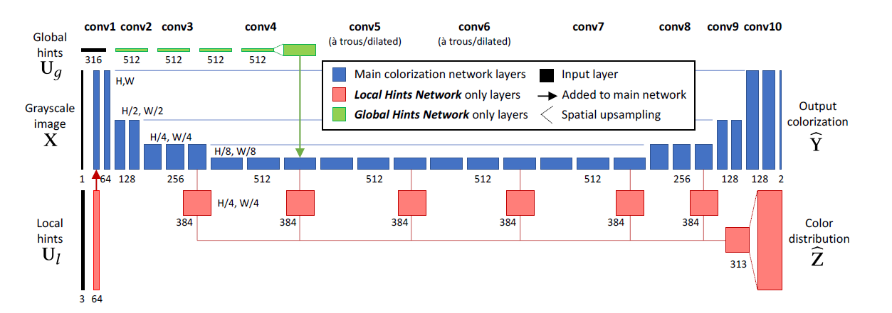

# Real-Time User-Guided Image Colorization with Learned Deep Priors

## 方法

本文训练了两个用户交互的着色网络变量，两个变量皆使用了蓝色网络进行预测着色。Local Hints 网络还使用了红色网络进行（a）融合用户的操作点 U_l 以及（b）预测网络分布 hat_Z。Global Hints 网络使用了绿色网络，将全局输入 U_g 通过 1x1 的卷积核进行转换，然后将结果融合进主着色网络。每个长方体代表一个卷积层，垂直长度代表特征映射空间分辨率

